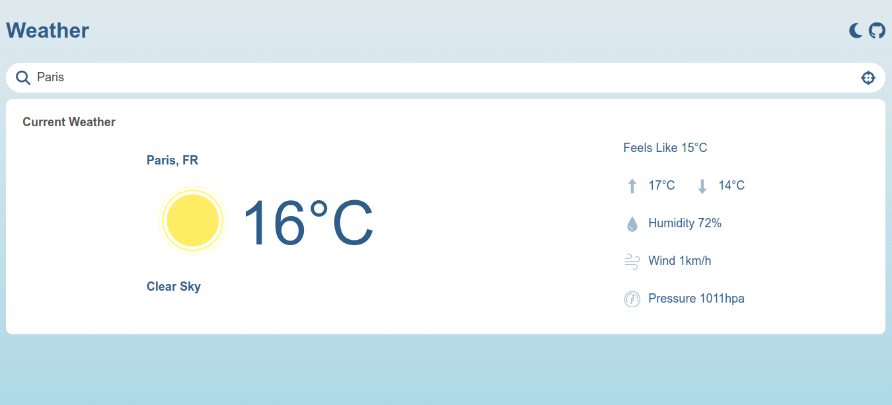

# Weather App

This is a simple Weather App project built using HTML, CSS, and JavaScript. It allows users to check the current weather of a city and provides additional weather details like temperature, humidity, wind speed, and pressure.

## Preview

[]

## Features

- Displays current weather information for a city.
- Allows searching for weather information by city name.
- Provides location-based weather information using geolocation.
- Supports dark mode.

## Technologies and Library Used

- HTML
- CSS
- JavaScript
- Fontawosome

## Usage

To use the Weather App:

1. Clone the repository:

```bash
  git clone https://github.com/talhashah-dev/weatherapp-js.git
```


3. Open the `index.html` file in your web browser.

## Contributing

Contributions are welcome! If you'd like to contribute to this project, please fork the repository and submit a pull request.

## Credits

This project uses the following resources:

- [Font Awesome](https://fontawesome.com/) - for icons.
- Weather API from [OpenWeather](https://openweathermap.org/).


